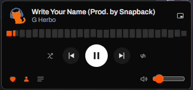

<p align="center">
  
</p>

<h1 align="center">SoundKitten</h1>

<p align="center">
  A lightweight, open-source, cross-platform desktop client for SoundCloud.<br />
  Built with <a href="https://tauri.app">Tauri</a> + Rust + Svelte, because the official app shouldn't need Electron to play music.
</p>

<p align="center">
  <a href="LICENSE"></a>
  
</p>

---

## Why

SoundCloud dropped their native Windows desktop app entirely. On Windows 11, the official "app" is just the web player installed as a Chrome PWA: no real desktop integration, nothing a browser tab wasn't already doing, and you need Chrome installed at all. SoundKitten is an actual native app, with a Rust backend, a native OS webview instead of a bundled browser, and a UI that matches soundcloud.com rather than reinventing it.

## Features

- Search, stream, like, comment, and browse playlists/likes/followers just like the web app
- Home feed with SoundCloud's own curated sections (Trending by genre, personalized mixes, etc.)
- A compact mini player (toggle from the app or the system tray) with SoundCloud's real per-track waveform, draggable and resizable
- Shuffle and repeat, drag-to-reorder queue, and playback state that survives an app restart
- Clean, native window chrome, no bundled browser UI, no bloat
- Auto-updates, checked on launch (opt-in per update, never silent)

<p align="center">
  
</p>

## Download

Grab the latest installer for your platform from [Releases](../../releases). Windows (`.msi`/`.exe`), macOS (`.dmg`, Apple Silicon and Intel), and Linux (`.AppImage`/`.deb`) builds are published there.

## How it works

SoundCloud doesn't offer a fully-functional public API for third-party apps. Their official OAuth flow has a long-standing upstream bug (see [`soundcloud/api` #513](https://github.com/soundcloud/api/issues/513) and [#393](https://github.com/soundcloud/api/issues/393)), so SoundKitten falls back to the same technique browser extensions and tools like `scdl` use: a `client_id` scraped from SoundCloud's own public web app bundle, combined with the user's own `oauth_token` session cookie, which is the same access their browser already has when logged into soundcloud.com. No credentials are sent anywhere but SoundCloud's own API; nothing is proxied through a third-party server.

**This app is streaming-only.** It does not download, save, export, or otherwise persist audio files, to stay within SoundCloud's API Terms of Use. DRM-protected tracks (major-label content served over encrypted HLS) are detected and clearly marked as unplayable, with a link out to soundcloud.com, rather than pretending they might work.

## Disclaimer

This project is **not affiliated with, endorsed by, or sponsored by SoundCloud**. It relies on undocumented, unofficial endpoints that may change or be revoked at any time. Use at your own risk.

## Development

Requires [Node.js](https://nodejs.org) and the [Rust toolchain](https://www.rust-lang.org/tools/install), plus Tauri's [platform prerequisites](https://tauri.app/start/prerequisites/).

```sh
npm install
npm run tauri dev
```

Run the test suite:

```sh
npm run test    # frontend (Vitest)
npm run check   # type-check
cargo check --manifest-path src-tauri/Cargo.toml
```

### Verification tooling

`tools/sc-probe` is a standalone CLI used during development to verify SoundCloud API behavior against the live service before building app features on top of it. It's not shipped as part of the app.

## Contributing

Contributions are welcome. See [CONTRIBUTING.md](CONTRIBUTING.md) for how to get set up and what to expect from the PR process.

## License

[MIT](LICENSE)
